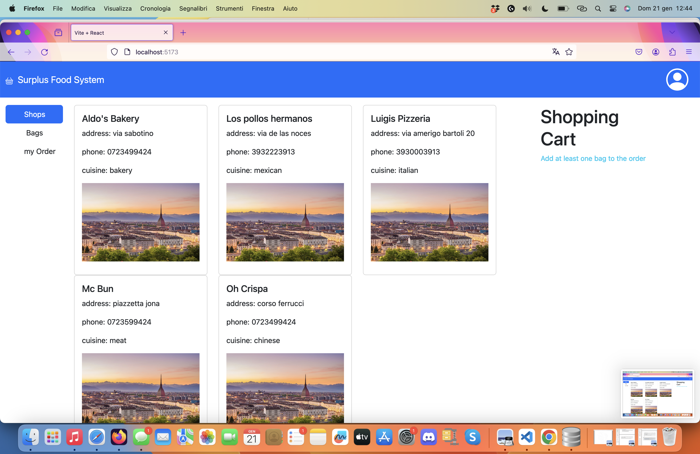
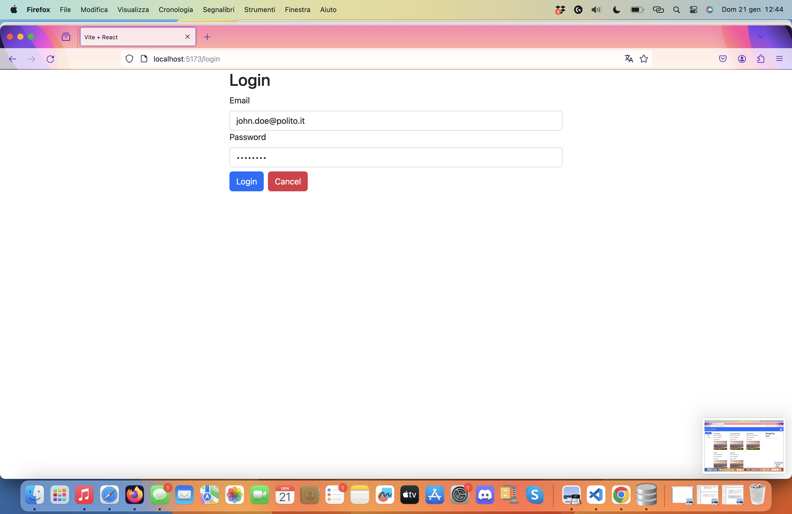
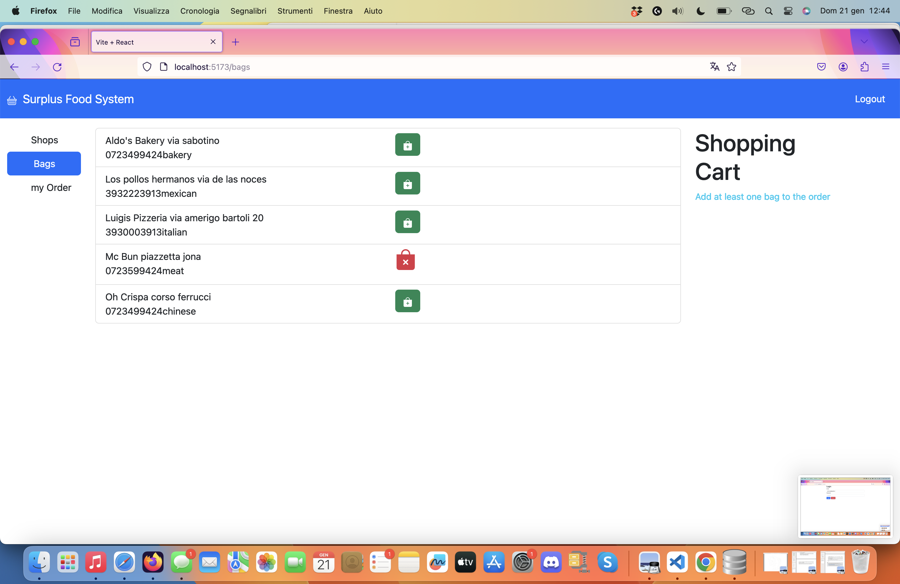
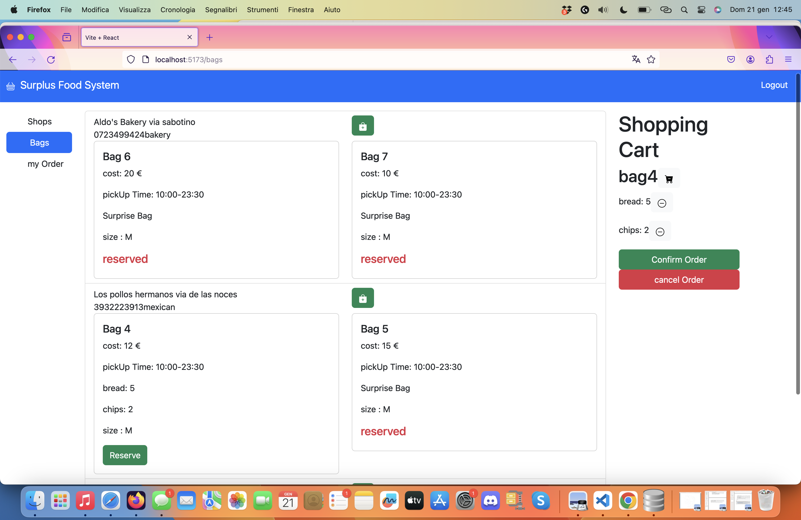
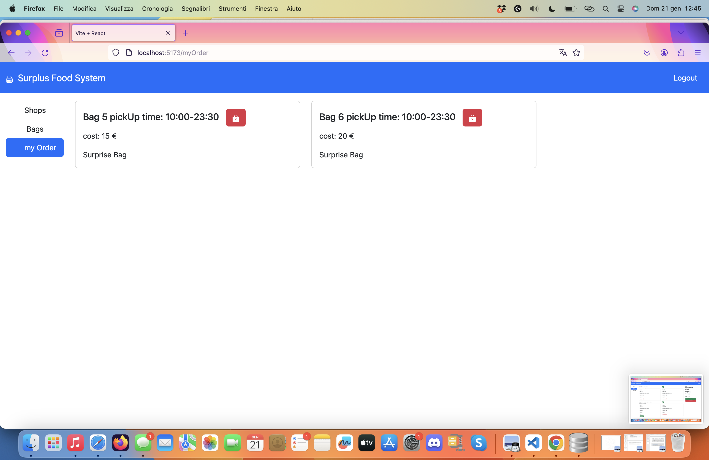

[](https://classroom.github.com/a/nTPFqRit)
# Exam #4: "Rescuing Surplus Food"

## Student: s306156 Mafrici Federico 

# Server side

## API Server

- POST `/api/login`
  - request parameters and request body content
  - response body content
- GET `/api/something`
  - request parameters
  - response body content
- POST `/api/something`
  - request parameters and request body content
  - response body content
- ...
### __Create a new session (login)__

URL: `/api/sessions`

HTTP Method: POST

Description: Create a new session starting from given credentials.

Request body:
```
{
  "username": "john.doe@polito.it",
  "password": "password"
}
```

Response: `200 OK` (success) or `500 Internal Server Error` (generic error).

Response body: _None_


### __Get the current session if existing__

URL: `/api/sessions/current`

HTTP Method: GET

Description: Verify if the given session is still valid and return the info about the logged-in user. A cookie with a VALID SESSION ID must be provided to get the info of the user authenticated in the current session.

Request body: _None_ 

Response: `201 Created` (success) or `401 Unauthorized` (error).

Response body:
```
{
  "username": "john.doe@polito.it",
  "id": 1,
}
```

### __Destroy the current session (logout)__

URL: `/api/sessions/current`

HTTP Method: DELETE

Description: Delete the current session. A cookie with a VALID SESSION ID must be provided.

Request body: _None_

Response: `200 OK` (success) or `500 Internal Server Error` (generic error).

Response body: _None_
### __Getting the shops from the database__ 

URL: `/api/shops`

Method: GET

Description: get all the shops. 

Request body: _None_

Response:   `200 OK` (success) or `500 Internal Server Error` (generic error).

Response body: An array of object, each describing a shop.
```
[
  {
    "shopId": 3,
    "name": "Aldo's Bakery",
    "address": "via sabotino",
    "phoneNumber": "0723499424",
    "typeOfCuisine": "bakery"
  }
]
```
### __Getting the bags from the database__ 
URL: `/api/bags`

Method: GET

Description: get all the bags. Since, the request can only come from authenticated users the request is authenticated

Request body: _None_

Response:   `200 OK` (success) or  `401 Not Authenticated` or  `500 Internal Server Error` (generic error).

Response body: An array of objects, each describing a bag.
```
[
  {
    "id": 1,
    "name": "bag1",
    "size": "M",
    "shopId": 1,
    "date": "10:00-23:30",
    "prize": 10,
    "type": "regular",
    "reserved": 1
  }, ...
]
```

### __Getting the items in each bag from the database__ 
URL: `/api/itemsInTheBags`

Method: GET

Description: get all the items inserted in a bag with the name and the needed info. Since, the request can only come from authenticated users the request is authenticated

Request body: _None_

Response:   `200 OK` (success) or  `401 Not Authenticated` or  `500 Internal Server Error` (generic error).

Response body: An array of objects, each describing a bag's item.
```
[
   {
    "itemId": 1,
    "ShopId": 1,
    "bagsId": 1,
    "itemname": "apple",
    "quantity": 4,
    "orderQuantity": 4
  },
  {
    "itemId": 2,
    "ShopId": 1,
    "bagsId": 1,
    "itemname": "banana",
    "quantity": 4,
    "orderQuantity": 4
  }, ...
]
```
### __Getting the bags ordered from the user__ 
URL: `/api/bags/reserved` 

Method: GET

Description: get all the bags ordered from a specific users,  the userId is associated with the one saved in the cookie's session to assure security. 

Request body: _None_

Response:   `200 OK` (success) or  `401 Not Authenticated` or  `404 No bags  ordered` or `500 Internal Server Error` (generic error).

Response body: An array of objects, each describing a bag which has the reserved status equal to the user identifier.
```
[
  {
    "id": 1,
    "name": "bag1",
    "size": "M",
    "shopId": 1,
    "date": "10:00-23:30",
    "prize": 10,
    "type": "regular",
    "reserved": 1
  },
  {
    "id": 5,
    "name": "bag5",
    "size": "M",
    "shopId": 2,
    "date": "10:00-23:30",
    "prize": 15,
    "type": "surprise",
    "reserved": 1
  }, ...
]
```
### __Getting the bags which have been ordered while choosing on the website __ 

URL: `/api/bags/reserved` 

Method: POST

Description: returning an empty query if there aren't already reserved bags in the order,otherwise it return the query with the bag ID which have already been booked by other users.

Request body: Vector of Bagid which are the bags in the shopping cart 

Response:   `200 OK` (success) or  `401 Not Authenticated` or  `400 already booked bags found  ` or `500 Internal Server Error` (generic error).

Response body: the   identifier of the bags in the shopping cart which have been reserved and an error message otherwise none (status 200).
```
{
  "error": " some bags have already been reserved from other users",
  "reservedBags": [
    {
      "bagsId": 1
    }
  ]
}
```
### __Reserve a specific id for the user__ 
URL: `/api/bags/:id` 

Method: POST

Description: reserve a bag with the user id associated in the cookie's information.

Request body: id of the bag to reserve , the user ID will be taken from the cookie's information

Response:   `200 OK` (success) or  `401 Not Authenticated` or `422 Generic problem withe bagId  give`  or `500 Internal Server Error` (generic error).

Response body: "1" value is returned if the rows status is update. Error messagge otherwise .


```
{
  1 
}

```
### __restore the orderered status of a bag__ 

URL: `/api/bags/reserved/:id` 

Method: POST

Description: freeing the reserved state of a bag , if the bag idenfier  doesn't exist an erorr message is returned otherwise it returns the id of the bag changed.

Request body: NONE 

Response:   `200 OK` (success) or  `401 Not Authenticated` or `422 Generic problem with bagId given` or `500 Internal Server Error` (generic error).

Response body:  value "1" if the changed has happened "0" if change  has gone wrong. 
 error message  if bag identifier not correct meaning that it doesn't even exist in the database 
```
{
  "errors": [
    {
      "type": "field",
      "value": "45",
      "msg": "The bag id specified doesnt exists",
      "path": "id",
      "location": "params"
    }
  ]
    // change without problem 
    1 
    // no change done 0 
}
```
### __Updating the item quantities with the user choices  __ 
URL: `/api/itemInTheBags/` 

Method: POST

Description: it receives an item object with the ordered quantity value which rappresent the value decided by the user durint the ordering phase.

Request body: item obect(id,name,quantity,ordered quantity ) 

Response:   `200 OK` (success) or  `401 Not Authenticated` or `500 Internal Server Error` (generic error).

Response body:  value "true" if the changed has happened "0" if change  has gone wrong. 
 error message  if a generic error appeared 
for example: 
```
{
true
}
```


## Database Tables

- Table `users` - contains id email hash salt 
- Table `shops` - contains id name address phoneNumber typeOfCuisine
- Table `bags` - contains id name shopId size bagDate prize type reserved 
- Table `items`- contains id name (of the item) 
- Table `itemsInTheBag` - contains id itemId bagId quantity orderQuantity 

# Client side


## React Client Application Routes

- Route `/`, page content and purpose: it shows the avaialble shops and the basic info about them.
- Route `/login`, page content and purpose: login panel to further proceed in the website.
- Route `/bags`,  page content and purpose: main panel where users can reserve bags and create orders.
- Route `/myOrder`, page content and purpose: section to check the user's order with the info needed and the possibility to delete the order if not interested anymore .


## Main React Components

- `ListOfSomething` (in `List.js`): component purpose and main functionality
- `GreatButton` (in `GreatButton.js`): component purpose and main functionality
- ...


-`FullWebPanel` (in `FullWebPanel.jsx`): it is the wrapper to all the website's main components 
-`ShopsAndBags` (in  `ShopsAndBags.jsx`): it shows the available bags in the shops 
-`ShopsList` (in  `Shopslist.jsx`): it shows the available shops for unathenticated users 
-`Bag` (in `Bag.jsx`): it shows the bag of a specific shop and the items it contains 
-`ShoppingCartPreview` (in  `ShoppingCartPreview.jsx`): it shows the shopping cart where the reserved bags are going to be and all the components needed to make orders.
-`SideBar` (in  `SideBar.jsx`): the sidebar of the website allows the users to easily change the website panels.


(only _main_ components, minor ones may be skipped)

# Usage info

users can easily check the shops available in the website and their information. then they  can try to proceed into other section but they will be blocked as a login is needed. 
Once a user has logged in it is possible to make order and cancel them, edit item quantities(maximum 2 item taken off from each bag) , remove a bag or confirm the final order. 
User can also check the pending orders he made and cancel them. 

a bag can be available to order, 
reserved by another user,
unavailable because the pickup time has ended.

## Example Screenshot








## Users Credentials

- username, password (plus any other requested info)
- username, password (plus any other requested info)
- john.doe@polito.it, password
- Fulvio.Corno@polito.it, password 
- federico.mafrici@polito.it, password 
